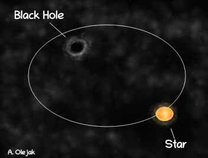
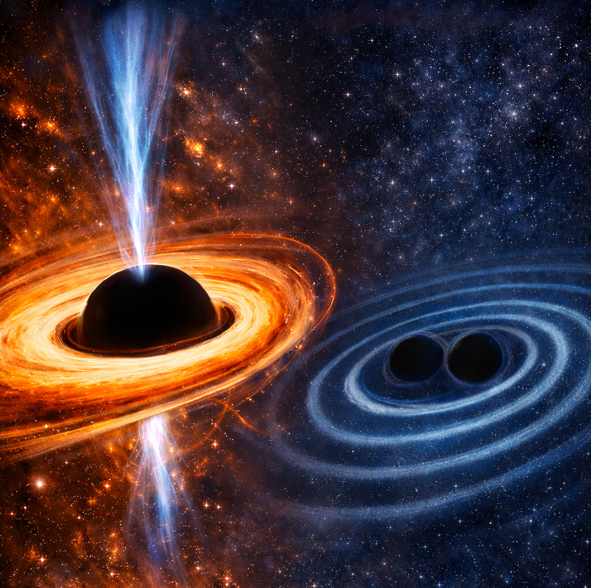
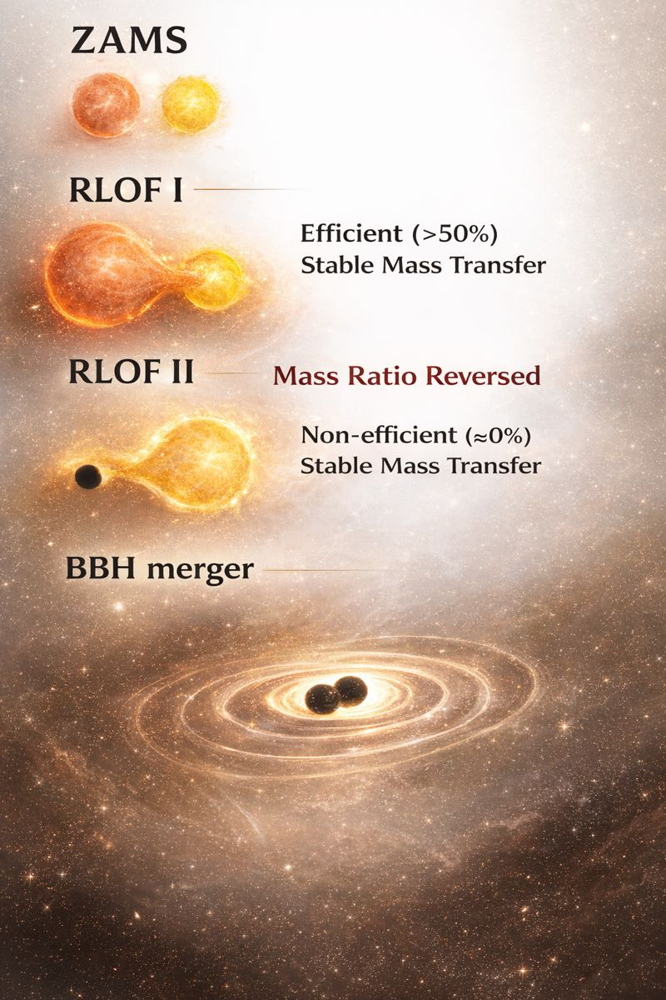
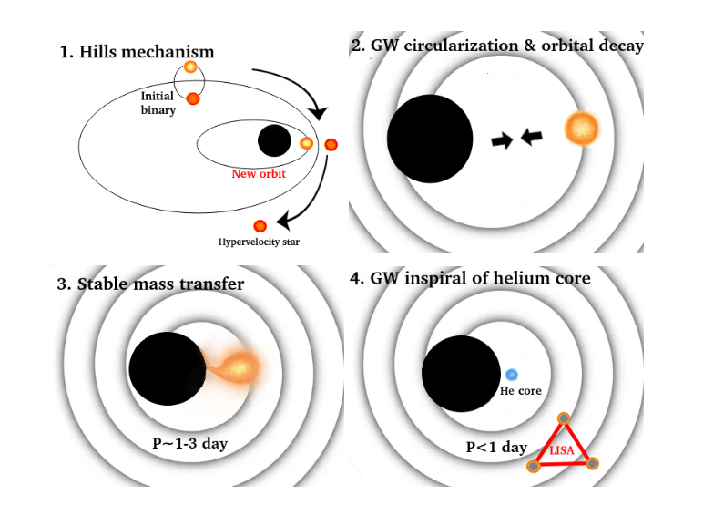



My academic path has been closely aligned with the scientific objectives of the LISA and LIGO-Virgo-KAGRA collaborations. My expertise lies in stellar evolution, compact-object astrophysics, and gravitational-wave astronomy, with a particular focus on binary interactions that lead to the formation of GW sources. My research spans the full evolutionary pathway from stellar birth to compact-object mergers, combining detailed stellar and binary evolution codes (MESA, StarTrack) with population synthesis to connect theoretical predictions with GW detections (LIGO–Virgo–KAGRA, LISA) and electromagnetic observations (e.g., Gaia black holes, X-ray binaries). During my postdoctoral fellowship at MPA, I began investigating systems where stars transfer mass onto supermassive black holes.
 
See the list of my publications at:

**ADS Library**: [ADS Public Library](https://ui.adsabs.harvard.edu/public-libraries/U0LMup96RQe2hPXDjU3Mcw) or
**ORCID**: [0000-0002-6105-6492](https://orcid.org/0000-0002-6105-6492)

# Recent Highlights
## New formation scenario of Gaia black holes 

The Gaia mission has revealed black hole binary systems with orbital separations and mass ratios that are difficult to reconcile with conventional binary evolution models. In our recently submitted work **Olejak et al. 2025b**: *Widening of Binaries via Non-conservative Mass Transfer as a Formation Channel for Gaia Black Hole System*, we propose a new formation pathway for these Gaia-type systems. Specifically, we suggest that a phase of mass loss carrying away low specific angular momentum occurred before or during Roche-lobe overflow. Mass loss predominantly from the vicinity of the donor can stabilize the mass transfer, reproducing systems with properties consistent with Gaia observations.

🔗 [Read the paper](https://arxiv.org/abs/2511.10728)

 

  

*Artistic vision of a wide, non-interacting binary system with a black hole and its distant, low-mass stellar companion.*

## Black Hole Spins

Our review **Zdziarski et al. (2026)**: *Spins of black holes in X-ray binaries and the tension with the gravitational wave measurements* has been published in **New Astronomy Reviews** (Volume 102, June 2026, 101746). It discusses the current understanding of black hole spin measurements in X-ray binaries and examines the emerging tension between these measurements and spin estimates inferred from gravitational-wave observations. We summarize observational techniques, systematic uncertainties, and the implications for compact-object formation and binary evolution. 

🔗 [Read the paper](https://www.sciencedirect.com/science/article/pii/S1387647325000259?dgcid=coauthor)

 

  

*Figure credit: AI-generated (OpenAI DALL·E) illustration of an accreting black hole emitting X-rays (left) and a merging binary black hole system emitting gravitational waves (right).*

## Astrophysics of gravitational wave sources

 

  

Cartoon illustrating the formation of a binary black hole merger via a stable mass transfer channel. Illustrations created with the assistance of ChatGPT (OpenAI).

 

  

Cartoon illustrating key stages: a binary disrupted by the supermassive black hole leaves one star bound and one ejected. The captured star’s orbit circularizes, undergoes stable mass transfer as a sub-giant, then its stripped core inspirals further, becoming a bright LISA-band gravitational wave source. Adopted from Olejak et al. 2025. 
