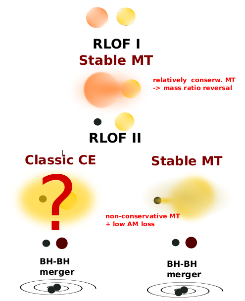



My academic path has been closely aligned with the scientific objectives of the LISA and LIGO-Virgo-KAGRA collaborations. My research interests include:

- Evolution of massive stars in isolated binary systems
- Evolutionary scenarios leading to the formation of binaries hosting compact objects
- Origin of gravitational wave signals 
- Stars in the galactic centers as multimessenger sources

See the list of my publications at
**ADS Library**: [ADS Public Library](https://ui.adsabs.harvard.edu/public-libraries/U0LMup96RQe2hPXDjU3Mcw) or
**ORCID**: [0000-0002-6105-6492](https://orcid.org/0000-0002-6105-6492)

 

  

Cartoon illustrating formation of binary black hole merger via stable mass transfer channel.

 

  

Cartoon illustrating key stages: a binary disrupted by the supermassive black hole leaves one star bound and one ejected. The captured star’s orbit circularizes, undergoes stable mass transfer as a sub-giant, then its stripped core inspirals further, becoming a bright LISA-band gravitational wave source. Adopted from Olejak et al. 2025. 
