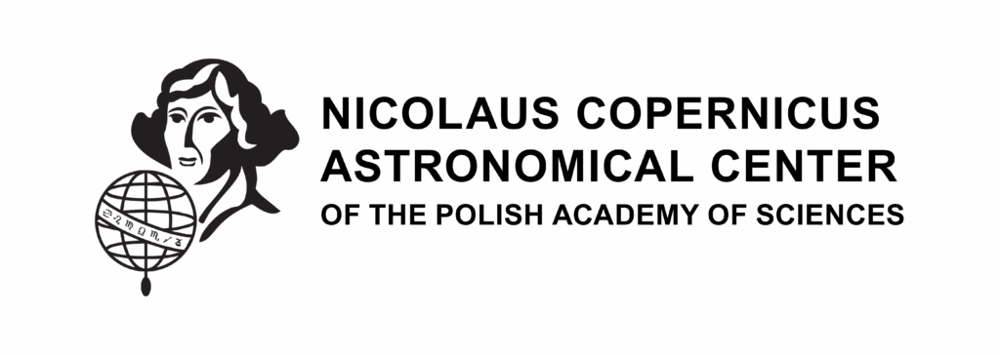



Welcome to my personal website!

I am a **postdoctoral fellow at the Max Planck Institute for Astrophysics**, soon moving to a **tenure-track position at the Nicolaus Copernicus Astronomical Center in Warsaw**.

- Evolution of massive stars in isolated binary systems
- Evolutionary scenarios leading to the formation of binaries hosting compact objects
- Origin of gravitational wave signals 
- Stars in the galactic centers as multimessenger sources

**Contact me:** aolejak@camk.edu.pl

**ADS Library**: [ADS Public Library](https://ui.adsabs.harvard.edu/public-libraries/U0LMup96RQe2hPXDjU3Mcw)
**ORCID**: [0000-0002-6105-6492](https://orcid.org/0000-0002-6105-6492)

  
  

