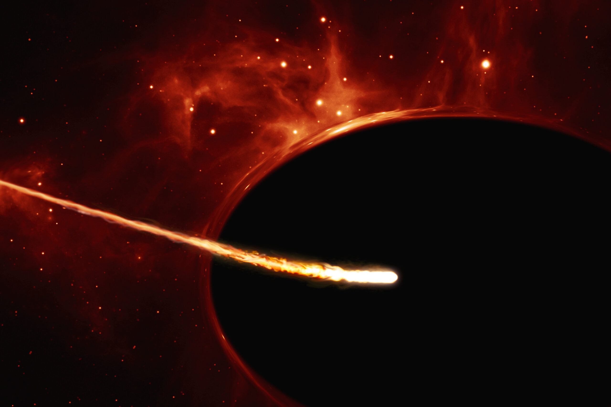
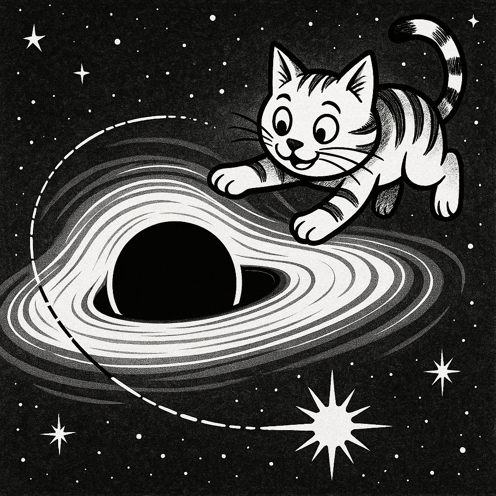



I actively engage in science communication and outreach through public talks, interviews, and popular science publications. 

 

  

Artist's impression of a supermassive black hole tearing apart a Sun-like star [© ESO, ESA/Hubble, M. Kornmesser; CC BY 4.0]. Used in an ["article by AAS Nova"](https://aasnova.org/2025/08/08/supermassive-black-holes-and-stripped-subgiants-significant-signals-for-future-gravitational-wave-detectors/).

## Interviews and popular science highlights of my research
- **August 2025**, *AAS Nova highlights for AAS's peer-reviewed journals*  
  ["Supermassive Black Holes and Stripped Subgiants: Significant Signals for Future Gravitational Wave Detectors"](https://aasnova.org/2025/08/08/supermassive-black-holes-and-stripped-subgiants-significant-signals-for-future-gravitational-wave-detectors/)
- **August 2025**, *Monthly Highlights of MPI for Astrophysics*  
  ["Gravitational Waves from Stars Stripped by Supermassive Black Holes?"](https://www.mpa-garching.mpg.de/1125545/hl202508)
- **July 2025**, *Science in Poland*  
  ["When a supermassive black hole rips a star off the shell"](https://naukawpolsce.pl/aktualnosci/news%2C108782%2Cfalujacy-podolbrzym-kiedy-supermasywna-czarna-dziura-oddziera-gwiazde-z)
- **April 2025**, *Phys.org & Universe Today*  
  [Phys.org](https://phys.org/news/2025-04-supermassive-black-holes-stars-helium.html) and
  Articles by [Universe Today](https://www.universetoday.com/articles/supermassive-black-holes-could-strip-stars-down-to-their-helium-cores) summarizing the paper *[Olejak et al 2025 ApJL 987 L11](https://iopscience.iop.org/article/10.3847/2041-8213/ade432)*
- **July 2022**, *Tygodnik Interia*  
  ["Our Galaxy is expected to host around 150 million black holes"](https://tygodnik.interia.pl/news-bada-czarne-dziury-w-naszej-galaktyce-moze-byc-ich-ok-150-mi,nId,6158562)
- **June 2022**, *Polish Radio*  
  ["Secrets of black hole formation"](https://jedynka.polskieradio.pl/artykul/2988212,Tajemnice-powstania-czarnych-dziur)
- **Oct 2020**, *Nature Research Highlights*  
  ["The odd couple: how a pair of mismatched black holes formed"](https://www.nature.com/articles/d41586-020-02792-6)
- **Oct 2020**, *Science in Poland*  
  ["Scientists explain how two black holes of hugely different masses collided"](https://naukawpolsce.pap.pl/aktualnosci/news%2C84121%2Co-tym-jak-doszlo-do-spotkania-dwoch-odmiennych-czarnych-dziur.html)
- **Oct 2022**, *ACADEMIA* (Magazine of the Polish Academy of Sciences): *"Space-time ripples"*
  

## Public Lectures

- **Nov 2019 & Sept 2019**, Warsaw, Poland  
  Lectures for the general public and physics teachers organized by the Nicolaus Copernicus Astronomical Center: *"Black holes in the Milky Way"*

## Physics teacher for high school students
- **Website of Niebieska Szkoła educational program** (for science sailing school activities):  
  - [Edition 14 (2016)](https://www.niebieskaszkola.pl/rejs,niebieska-szkola-14,81/)  
  - [Edition 24 (2020)](https://www.niebieskaszkola.pl/rejs,niebieska-szkola-24,145/)

 

  

---
