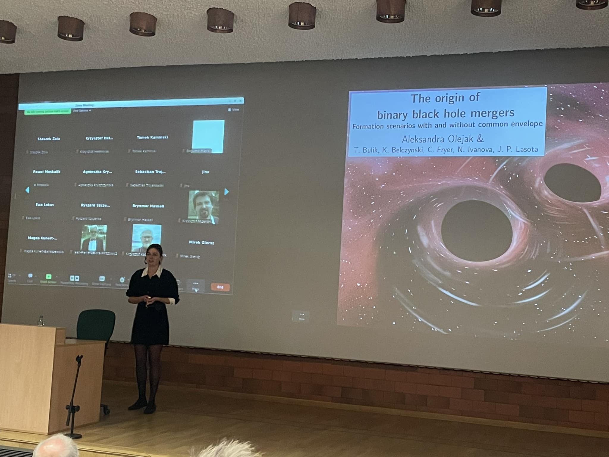



## Selected Talks & Seminars

### 2025
- **Invited talk (upcoming)**: *Crossroads in Strong Gravity Challenges & Future Directions*  
  Catania, Italy (Sep 2025)

- **Invited talk (upcoming)**: *5th Philip Wetton Workshop*  
  Oxford, UK (Sep 2025)

- **Seminar**: *The origin of gravitational wave sources. Isolated binary progenitors of binary black hole mergers*  
  Princeton University, USA (Jun 2025)

- **Seminar**: *Supermassive black holes stripping a subgiant star down to its helium core: a new type of multi-messenger source for LISA*  
  Milano Bicocca, Italy (Apr 2025)

- **Talk**: *Supermassive black holes stripping a subgiant star down to its helium core: a new type of multi-messenger source for LISA*  
  MIAPbP workshop, Munich, Germany (Mar 2025)

---

### 2024
- **Seminar**: *The origin of compact object mergers*  
  Institut d’Astrophysique de Paris, France (Dec 2024)

- **Invited talk**: *The origin of compact object mergers. Isolated binary formation scenarios*  
  Conference "Challenges and future perspectives in gravitational-wave astronomy: O4 and beyond", Leiden, Netherlands (Oct 2024)

- **Talk**: *Gravitational wave signal from circular, mass transferring star-supermassive black hole systems*  
  LISA Astrophysics Working Group Meeting 2024, Garching bei München, Germany (Sep 2024)

- **Talk**: *Gravitational wave signal from circular, mass transferring star-supermassive black hole systems*  
  Conference on Galactic and extragalactic X-ray transients, Warsaw, Poland (Sep 2024)

- **Talk**: *Unequal-mass, highly-spinning binary black hole mergers in stable mass transfer formation channel*  
  IAU General Assembly 2024, Cape Town, South Africa (Aug 2024)

- **Talk**: *Unequal-mass, highly-spinning binary black hole mergers in stable mass transfer formation channel*  
  41st Liège International Astrophysical Colloquium, Belgium (Jul 2024)

- **Invited panelist**: *Panel Discussion - Binary Formation Channels*  
  GWPAW 2024, Birmingham, UK (May 2024)

- **Seminar**: *Fingerprints of binary star interactions in the parameters of binary black hole mergers*  
  Warsaw Astronomical Observatory, Poland (Mar 2024)

- **Seminar**: *The origin of gravitational wave sources. Isolated binary progenitors of binary black hole mergers*  
  Max Planck Institute for Astrophysics, Germany (Nov 2023)

---

### 2023 and earlier
- **Panelist**: *What can/should astrophysicists and pop-synthers predict?*  
  Gravitational-wave populations: what’s next?, Milano, Italy (Jul 2023)

- **Seminar**: *What can we learn about stars from gravitational waves?*  
  Max Planck Institute for Astrophysics, Germany (Jan 2023)

- **Invited talk**: *What can we learn about stars from gravitational waves?*  
  TMEX-2023 Conference, Rencontres du Vietnam, Quy Nhon, Vietnam (Jan 2023)

- **Talk**: *The role of supernova convection for the depth of lower mass gap and the isolated binary formation of LVK sources*  
  2022 INTERMEDIATE-MASS BLACK HOLES Conference, Puerto Rico (Apr 2022)

- **Seminar**: *Impact of common envelope development criteria on the formation of BH-BH mergers*  
  Nicolaus Copernicus Astronomical Center, Torun, Poland (Nov 2021)

- **Seminar**: *The origin of BH-BH mergers. The isolated binary evolution scenario*  
  Institut d’Astrophysique de Paris (Nov 2021, online)

- **Talk**: *Impact of common envelope development criteria on the formation of LIGO/Virgo sources*  
  XL Congress of the Polish Astronomical Society (Sep 2021, online)

- **Talk**: *Impact of common envelope development criteria on the formation of LIGO/Virgo sources*  
  GWVerse COST action, Lisbon, Portugal (Aug 2021)

- **Talk**: *Binary neutron star formation and the origin of GW170817*  
  Sixteenth Marcel Grossman Meeting (Jul 2021, online)

- **Talk**: *Synthetic catalog of black holes in the Milky Way*  
  Astrophysics with GW detections, Warsaw, Poland (Sep 2019)

  

